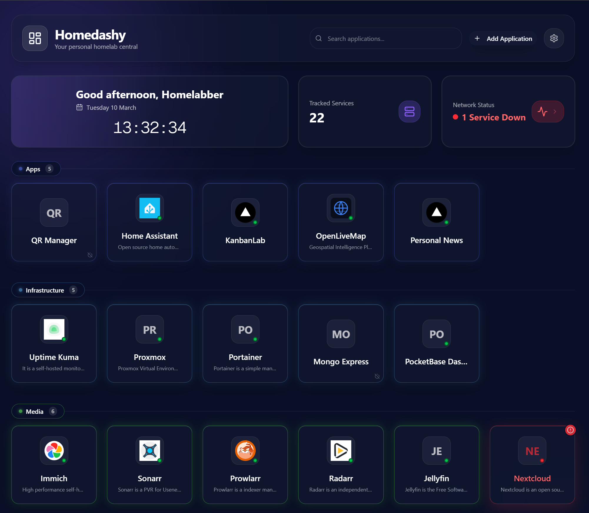
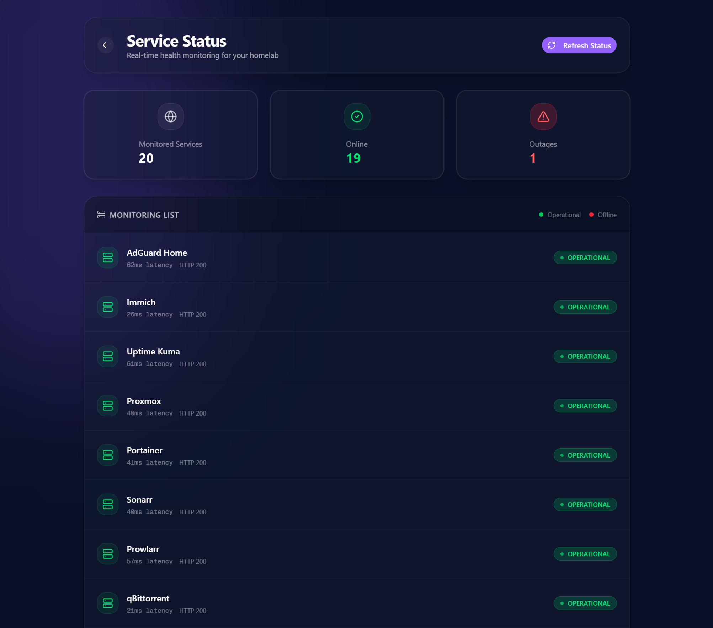
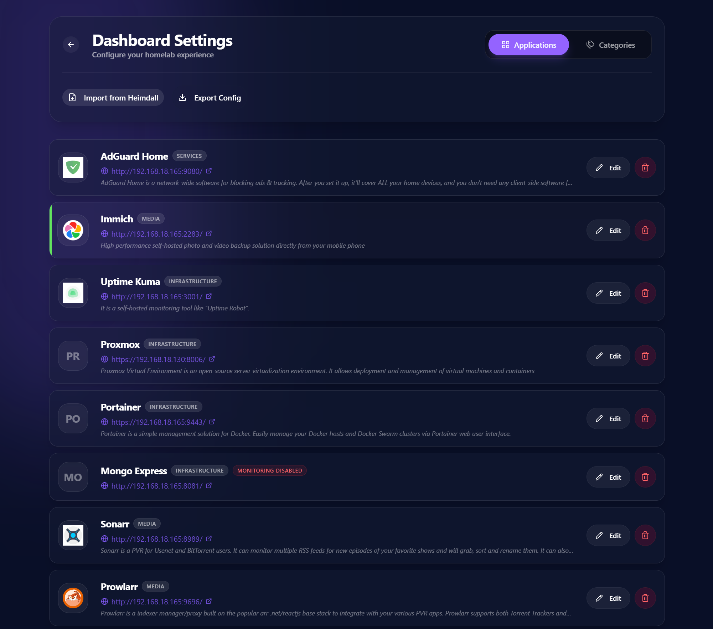

# 🌌 Homedashy

[](https://opensource.org/licenses/MIT)
[](https://nextjs.org/)
[](https://orm.drizzle.team/)
[](https://tailwindcss.com/)

**Homedashy** is a modern, high-performance, and visually stunning dashboard for your homelab. Built with a "Liquid Glass" (glassmorphism) aesthetic, it combines real-time monitoring with a premium user experience to help you manage your self-hosted infrastructure with style.

---

## ✨ Key Features

- **💎 Liquid Glass UI**: A state-of-the-art design system featuring vibrant gradients, backdrop blurs, and smooth micro-animations.
- **📡 Real-time Health Monitoring**: Integrated server-side status checks for all your services with live latency and HTTP response tracking.
- **🏷️ Smart Categorization**: Organize your apps into custom categories with dynamic accent colors and glow effects.
- **🚀 One-Click Navigation**: Quick access to all your homelab services from a centralized, beautiful hub.
- **🛠️ Unified Management**: A dedicated settings suite to manage applications and categories on a single, intuitive page.
- **📥 Heimdall & JSON Import**: Effortlessly migrate from Heimdall or import/export your entire configuration via JSON.
- **🏠 Info HUD**: At-a-glance dashboard stats including local time, system uptime, and network status summary.

---

## 📸 Screenshots

### 🖼️ Main Dashboard
Experience the full glory of the liquid glass interface.


### 📊 Service Status & Outages
Keep an eye on your infrastructure with real-time connectivity states and latency metrics.


### ⚙️ Unified Settings
Manage your entire dashboard setup from a single, high-fidelity interface.


---

## 🛠️ Tech Stack

- **Framework**: [Next.js 15+](https://nextjs.org/) (App Router & Turbopack)
- **Database**: [SQLite](https://sqlite.org/) via [Drizzle ORM](https://orm.drizzle.team/)
- **Styling**: [Tailwind CSS 4](https://tailwindcss.com/) & [Lucide Icons](https://lucide.dev/)
- **State Management**: [TanStack Query (v5)](https://tanstack.com/query/latest)
- **UI Components**: [Radix UI](https://www.radix-ui.com/) & [Shadcn UI](https://ui.shadcn.com/)
- **Animation**: Tailwind Animate & CSS Backdrop Filters

---

## 🚀 Getting Started

### Prerequisites

- [Node.js](https://nodejs.org/) (v18 or later)
- [npm](https://www.npmjs.com/) or [yarn](https://yarnpkg.com/)

### Installation

1. **Clone the repository**
   ```bash
   git clone https://github.com/yourusername/homedashy.git
   cd homedashy
   ```

2. **Install dependencies**
   ```bash
   npm install
   ```

3. **Initialize the database**
   ```bash
   # Drizzle will use sqlite.db in the root directory
   npx drizzle-kit push
   ```

4. **Run the development server**
   ```bash
   npm run dev
   ```

5. **Access the dashboard**
   Open [http://localhost:3344](http://localhost:3344) in your browser.

---

## 🐳 Docker Deployment

The easiest way to host Homedashy is using Docker.

### Using Docker Compose (Recommended)

1. Create a `docker-compose.yml` (if not already present):
   ```yaml
   version: '3.8'
   services:
     homedashy:
       image: ghcr.io/yourusername/homedashy:latest # or build: .
       container_name: homedashy
       ports:
         - "3344:3000"
       volumes:
         - ./data:/app/data
       environment:
         - DB_PATH=/app/data/sqlite.db
       restart: always
   ```

2. Spin up the container:
   ```bash
   docker-compose up -d
   ```

### Building Manually
```bash
docker build -t homedashy .
docker run -p 3344:3000 -v $(pwd)/data:/app/data -e DB_PATH=/app/data/sqlite.db homedashy
```

---

## ⚙️ Configuration

- **Adding Apps**: Click its "Add Application" button (plus icon) in the header.
- **Importing from Heimdall**: Navigate to **Settings** -> **Import** and select your Heimdall JSON export.
- **Health Checks**: Enable "Health Monitoring" in the app edit modal to track status on the Outages page.

---

## 📝 License

Distributed under the MIT License. See `LICENSE` for more information.

---

<p align="center">
  Built with ❤️ for the Homelab Community
</p>
